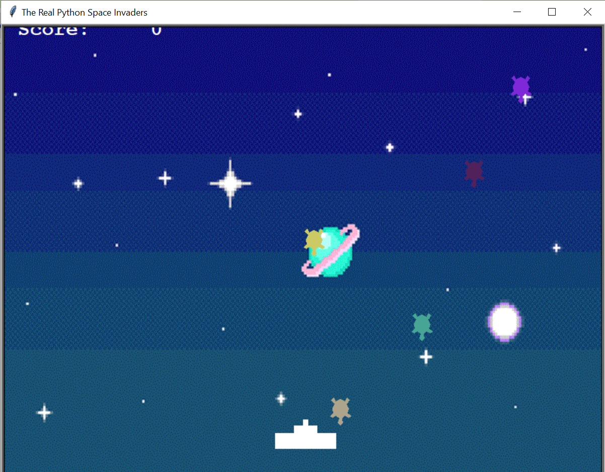
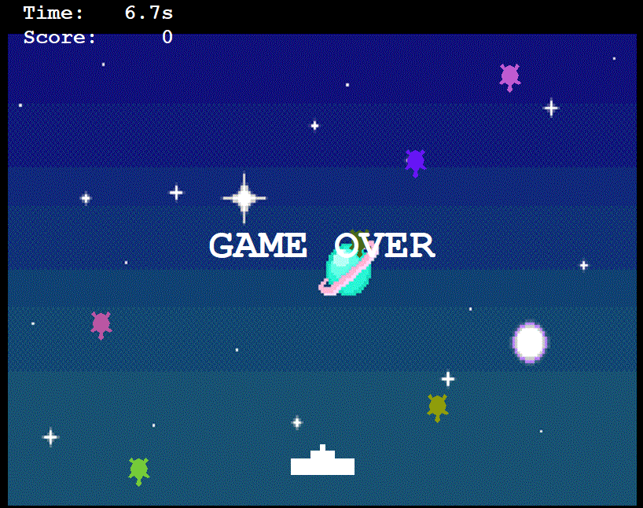

# Space Invaders Game

This is a simple Space Invaders game built in Python using the turtle graphics library. Blast the alien invaders, earn points, and watch out for their attacks!

## How to Play

- Use the Left and Right arrow keys to move the cannon.
- Press the Spacebar to fire lasers and destroy the aliens.
- Earn points by hitting the aliens with your lasers.
- Watch out for the aliens' attacks - if they reach the bottom, it's game over!
- Every time your score reaches a multiple of 1000, you'll get a bonus of 500 points!

## Features

- Classic Space Invaders gameplay.
- Colorful alien invaders that move down the screen.
- Sound effects for firing lasers, hitting aliens, and bonus points.
- Background music to enhance the gaming experience.
- Bonus points every time your score reaches a multiple of 1000.

## Installation

1. Clone the repository:
```bash
git clone https://github.com/your-username/space-invaders-python.git
```

1. Install Python (if not already installed):

2. Install the required libraries:
```bash
pip install -r requirements.txt
```

## Usage
1. Navigate to the project directory:
```bash
cd space-invaders-python
```
2. Run the game:
```bash
python turtle_invaders_with_sound.py
```

## Screenshots






